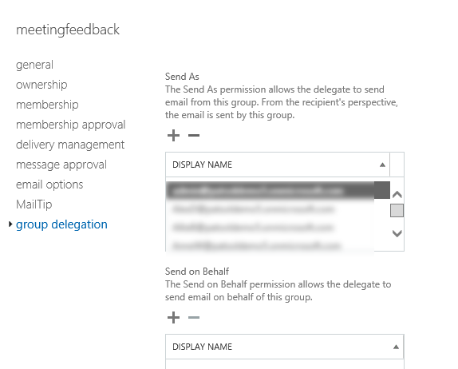

# Android 用 Office 365 ミーティング フィードバック サンプル

[](http://youtu.be/VXdEtKIPxi8 "クリックして、サンプルの操作をご覧ください")

ミーティング フィードバックは、Microsoft Graph の Office 365 エンドポイントを使用して、予定表イベントを取得し、サインインしているユーザーに代わって電子メールを送信します。

## デバイスの要件

サンプルを実行するには、デバイスが次の要件を満たしている必要があります。

* Android の API レベルが 15 以上である。
 
## 前提条件

サンプルには、Android クライアントと Ruby on Rails サーバー側のコンポーネントが含まれています。また、ユーザーが電子メール通知を取得する場所からエイリアスをセットアップする必要があります。

### Android クライアントのコンポーネント

* [Android Studio](http://developer.android.com/sdk/index.html) バージョン 1.0 以上。
* Office 365 アカウント。Office 365 アプリのビルドを開始するために必要なリソースを含む、[Office 365 Developer サブスクリプション](http://aka.ms/o365-android-connect-signup)にサインアップできます。開発者のサブスクリプションを取得すると、Office 365 アカウントも取得できます。 
* Azure に登録されたアプリケーションのクライアント ID とリダイレクト URI の値。アプリケーションは、**[ユーザーとしてメールを送信する]** と **[ユーザーの予定表の読み取り]** のアクセス許可を実行する必要があります。[Azure にネイティブ クライアント アプリケーションを追加](https://msdn.microsoft.com/office/office365/HowTo/add-common-consent-manually#bk_RegisterNativeApp)し、[適切なアクセス許可を付与](https://github.com/OfficeDev/O365-Android-MeetingFeedback/wiki/Grant-permissions-to-the-application-in-Azure)します。

### Ruby on Rails アプリケーションのコンポーネント

* Ruby 2.0.0
* Ruby 開発キット (Windows インストール時のみ使用)

## Ruby on Rails アプリケーションのインストール

1. O365-Android_MeetingFeedback リポジトリ内の Web サービス フォルダーに移動します。
2. 次のコマンドを実行して、以下のタスクを実行します。

	* ビルダー gem をインストール
	* ミーティング フィードバックの Ruby on Rails アプリケーションをインストール
	* ミーティング フィードバックのデータベースを作成
	* ポート番号 5000 でミーティング フィードバック サービスを開始

```
gem install builder
bundle install
rake db:create && rake db:migrate && bundle exec foreman start -p 5000
```

## 匿名の電子メール通知を受信する電子メール グループのセットアップ

ホストしている会議のいずれかがレビューされるときに、アプリは会議の開催者に電子メール通知を送信します。フィードバックの匿名性を保つため、電子メールは指定されたメール アドレスから送信されます。これを有効にするには、Office 365 上に Exchange グループをセットアップする必要があります。Exchange グループをセットアップするには、以下の手順に従います。

1. http://office.com に移動し、テナント管理者としてサインインします。
2. **[管理]** タイルをクリックします。
3. ナビゲーション バーの **[管理者]** -&gt; **[Exchange]** をクリックします。
4. **[受信者]**セクションの**[グループ]** をクリックします。
5. 新しい**セキュリティ グループ**を追加するには、プラス記号をクリックします。
6. 表示名、エイリアス、メール アドレスを追加し、グループを保存します。
7. グループを選択し、鉛筆アイコンをクリックして編集します。
8. **[グループ委任]** に移動し、次の図が示すように、アプリのユーザーに **[メールボックス所有者として送信する]** アクセス許可を与えます。
9. **Constants.java** ファイルの **REVIEW_SENDER_ADDRESS** の値を更新して、グループのメール アドレスと一致させます。
 

## Android Studio を使用してサンプルを開く

1. developer.android.com の[指示](http://developer.android.com/sdk/installing/adding-packages.html)に従って、[Android Studio](http://developer.android.com/tools/studio/index.html#install-updates) をインストールし、Android SDK パッケージを追加します。
2. このサンプルをダウンロードするか、クローンを作成します。
3. Android Studio を起動します。
	1. **[既存の Android Studio プロジェクトを開く]** を選択します。
	2. ローカル リポジトリを参照し、O365-Android-MeetingFeedback プロジェクトを選択します。**[OK]** をクリックします。
4. Constants.java ファイルを開きます。
	1. SERVICE_ENDPOINT 定数を検索し、マシンの IP アドレスと、Ruby on Rails サービスを実行しているポートに値を設定します。
	2. CLIENT\_ID 定数を検索して、その String 値を Azure Active Directory に登録されているクライアント ID と同じ値に設定します。
	3. REDIRECT\_URI 定数を検索して、その String 値を Azure Active Directory に登録されているリダイレクト URI と同じ値に設定します。
    

    > 注:CLIENT\_ID と REDIRECT\_URI の値がない場合は、[ネイティブ クライアント アプリケーションを Azure に追加](https://msdn.microsoft.com/office/office365/HowTo/add-common-consent-manually#bk_RegisterNativeApp)し、CLIENT\_ID と REDIRECT_URI を書き留めます。

サンプルをビルドしたら、エミュレーターまたはデバイス上で実行できます。

## 質問とコメント

Office 365 ミーティング フィードバック サンプルについて、Microsoft にコメントをお寄せください。質問や提案につきましては、このリポジトリの「[問題](https://github.com/OfficeDev/O365-Android-Connect/issues)」セクションに送信できます。

Office 365 開発全般の質問につきましては、「[スタック オーバーフロー](http://stackoverflow.com/questions/tagged/Office365+API)」に投稿してください。質問またはコメントには、必ず [Office365] および [API] のタグを付けてください。

開発者がこのサンプルのビルドにいたるまでの過程について、関心がありますか。[Medium の記事](https://medium.com/p/572432b96089)をお読みください。

## その他の技術情報

* [Office 365 API プラットフォームの概要](https://msdn.microsoft.com/office/office365/howto/platform-development-overview)
* [Office 365 SDK for Android](https://github.com/OfficeDev/Office-365-SDK-for-Android)
* [アプリで Office 365 API の使用を開始する](https://msdn.microsoft.com/office/office365/howto/getting-started-Office-365-APIs)
* [Office 365 API スタート プロジェクトおよびサンプル コード](https://msdn.microsoft.com/office/office365/howto/starter-projects-and-code-samples)
* [Android 用 Office 365 Connect サンプル](https://github.com/OfficeDev/O365-Android-Connect)
* [Android 用 Office 365 コード スニペット](https://github.com/OfficeDev/O365-Android-Snippets)
* [Android 版 Office 365 API スタート プロジェクト](https://github.com/OfficeDev/O365-Android-Start)
* [Android 用 Office 365 プロファイル サンプル](https://github.com/OfficeDev/O365-Android-Profile)

## 著作権
Copyright (c) 2015 Microsoft.All rights reserved.

