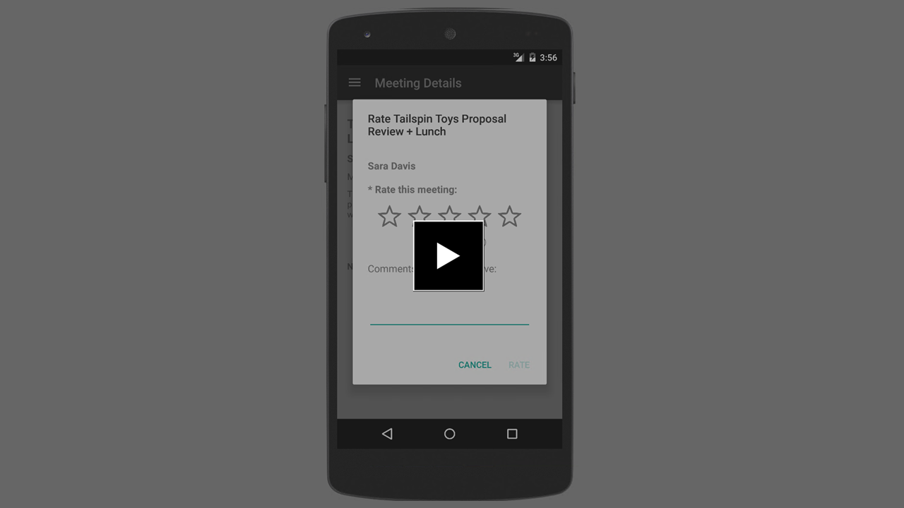

# Пример приложения Office 365 Meeting Feedback для Android

[](http://youtu.be/VXdEtKIPxi8 "Щелкните, чтобы просмотреть пример в действии")

Приложение Meeting Feedback использует конечные точки Office 365 в Microsoft Graph для извлечения событий календаря и отправки сообщений от имени вошедшего пользователя.

## Требования к устройству

Для запуска примера устройство должно соответствовать следующим требованиям:

* API Android уровня 15 или более высокого.
 
## Необходимые компоненты

Пример включает клиент Android и серверный компонент Ruby on Rails. Кроме того, необходимо создать электронный адрес-псевдоним, с которого пользователи будут получать уведомления.

### Клиентский компонент Android

*[Android Studio](http://developer.android.com/sdk/index.html) версии 1.0 или более поздней.
* Учетная запись Office 365. Вы можете [подписаться на план Office 365 для разработчиков](http://aka.ms/o365-android-connect-signup), который включает ресурсы, необходимые для создания приложений Office 365. Вместе с подпиской разработчика вы получаете учетную запись Office 365. 
* URI перенаправления и идентификатор клиента, указанные при регистрации приложения в Azure. Приложение должно иметь разрешения на **отправку почты от имени пользователя** и **чтение календарей пользователей**. Вы также можете [добавить собственное клиентское приложение в Azure](https://msdn.microsoft.com/office/office365/HowTo/add-common-consent-manually#bk_RegisterNativeApp) и [предоставить ему необходимые разрешения](https://github.com/OfficeDev/O365-Android-MeetingFeedback/wiki/Grant-permissions-to-the-application-in-Azure).

### Компонент приложения Ruby on Rails

* Ruby 2.0.0
* Комплект разработки Ruby (только для установки в Windows)

## Установка приложения Ruby on Rails

1. Перейдите в папку webservice в репозитории O365-Android\_MeetingFeedback.
2. Чтобы выполнить следующие задачи, воспользуйтесь такими командами:

	* Установка gem-пакета конструктора
	* Установка приложения Ruby on Rails Meeting Feedback
	* Создание базы данных Meeting Feedback
	* Запуск службы Meeting Feedback через порт 5000

```
gem install builder
bundle install
rake db:create && rake db:migrate && bundle exec foreman start -p 5000
```

## Настройка группы электронной почты для получения анонимных уведомлений

Приложение отправляет уведомление организатору собрания, если оно получает отзыв. Сообщение отправляется со специального адреса, чтобы обеспечить анонимность отзыва. Для этого необходимо создать группу Exchange в Office 365. Чтобы создать группу Exchange, сделайте следующее:

1. Откройте страницу http://office.com и войдите от имени администратора клиента.
2. Щелкните плитку **Администратор**.
3. На панели навигации выберите **Администратор** -> **Exchange**.
4. Выберите элемент **группы** в разделе **получатели**.
5. Щелкните значок плюса, чтобы добавить новую **группу безопасности**.
6. Добавьте отображаемое имя, псевдоним и адрес электронной почты и сохраните группу.
7. Выберите группу и щелкните значок карандаша для редактирования.
8. Перейдите в раздел **делегирование группы** и предоставьте пользователям приложения разрешение **Отправить как**, как показано на приведенном ниже рисунке. 
9. Обновите значение **REVIEW\_SENDER\_ADDRESS** в файле **Constants.java** в соответствии с адресом электронной почты группы.
 

## Открытие примера с помощью Android Studio

1. Установите [Android Studio](http://developer.android.com/tools/studio/index.html#install-updates) и добавьте пакеты SDK для Android в соответствии с [инструкциями](http://developer.android.com/sdk/installing/adding-packages.html) на сайте developer.android.com.
2. Скачайте или клонируйте этот пример.
3. Запустите Android Studio.
	1. Выберите элемент **Open an existing Android Studio project** (Открыть существующий проект Android Studio).
	2. Перейдите в локальный репозиторий и выберите проект O365-Android-MeetingFeedback. Нажмите кнопку **ОК**.
4. Откройте файл Constants.java.
	1. Найдите константу SERVICE\_ENDPOINT и укажите IP-адрес компьютера и порт, на котором запущена служба Ruby on Rails.
	2. Найдите константу CLIENT\_ID и присвойте ей строковое значение, которое равно идентификатору клиента, зарегистрированному в Azure Active Directory.
	3. Найдите константу REDIRECT\_URI и присвойте ей строковое значение, которое равно URI перенаправления, зарегистрированному в Azure Active Directory. 

    > Примечание. Если у вас нет значений CLIENT\_ID и REDIRECT\_URI, [добавьте собственное клиентское приложение в Azure](https://msdn.microsoft.com/office/office365/HowTo/add-common-consent-manually#bk_RegisterNativeApp) и запишите CLIENT\_ID и REDIRECT\_URI.

После сборки пример можно запустить в эмуляторе или на устройстве.

## Вопросы и комментарии

Мы будем рады вашим комментариям о примере Office 365 Meeting Feedback. Вы можете отправлять нам вопросы и предложения в разделе [Issues](https://github.com/OfficeDev/O365-Android-Connect/issues) этого репозитория.

Общие вопросы о разработке решений для Office 365 следует публиковать на сайте [Stack Overflow](http://stackoverflow.com/questions/tagged/Office365+API). Обязательно помечайте свои вопросы и комментарии тегами [Office365] и [API].

Хотите узнать больше о разработке этого примера? Прочитайте [статью на сайте Medium](https://medium.com/p/572432b96089).

## Дополнительные ресурсы

* [Общие сведения о платформе API Office 365](https://msdn.microsoft.com/office/office365/howto/platform-development-overview)  
* [Пакет SDK Office 365 для Android](https://github.com/OfficeDev/Office-365-SDK-for-Android)  
* [Начало работы с API Office 365 в приложениях](https://msdn.microsoft.com/office/office365/howto/getting-started-Office-365-APIs)  
* [Проекты API Office 365 и примеры кода для начинающих](https://msdn.microsoft.com/office/office365/howto/starter-projects-and-code-samples)  
* [Приложение Office 365 Connect для Android](https://github.com/OfficeDev/O365-Android-Connect)  
* [Фрагменты кода Office 365 для Android](https://github.com/OfficeDev/O365-Android-Snippets)  
* [Проект API Office 365 для Android для начинающих](https://github.com/OfficeDev/O365-Android-Start)  
* [Пример профиля Office 365 для Android](https://github.com/OfficeDev/O365-Android-Profile)  


## Авторские права
(c) Корпорация Майкрософт (Microsoft Corporation), 2015. Все права защищены.
